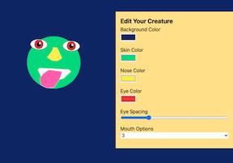

# SVG-Practice

* This simple one-page application uses Vue to control svg's. The user can update the skin, nose, and eye color of their character, as well as change the eye spacing and choose from different mouth options. 

[Site Link](https://lesliejpatino.github.io/svg-practice/)
 

## Technologies Used
* Vue
* Tailwind CSS Framework
* Animate.css
* HTML/CSS

## Resources Used
[Code Time on YouTube](https://www.youtube.com/watch?v=Fjeep99J2xo&list=PLylMDDjFIp1BCxG2AMTU6w8AZEgtdtmS6&index=1)

## Author
* [Leslie Patino](https://www.linkedin.com/in/lesliejpatino/)

* [Code Time](https://www.youtube.com/watch?v=Fjeep99J2xo&list=PLylMDDjFIp1BCxG2AMTU6w8AZEgtdtmS6&index=1)

## License

MIT License  
  
Copyright (c) 2022 Leslie Patino
